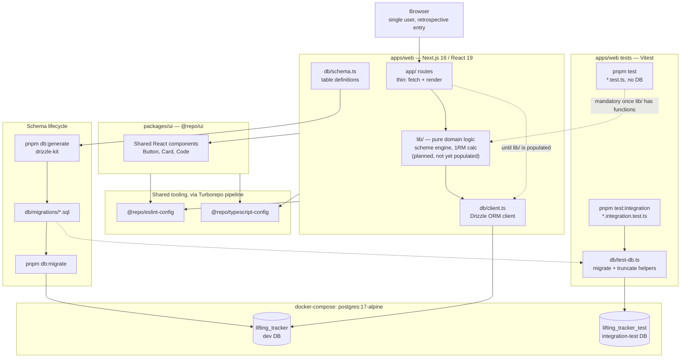

# Architecture overview

Current state — single-user, no-auth, retrospective data entry (not live in-gym). One app (`apps/web`), no `apps/docs` despite what the stock Turborepo `README.md` still says.

## Reading this

- **`lib/` is drawn dashed because it's empty** — `code-conventions.md` documents it as the intended home for pure domain logic (scheme engine, 1RM calc), but nothing has landed there yet. Routes currently have nowhere to delegate to but `db/client.ts` directly.
- **Two databases, one Postgres container.** `lifting_tracker` (dev) and `lifting_tracker_test` (integration tests) are separate databases on the same `docker-compose` instance — never the same DB, per [testing.md](../testing.md)'s isolation strategy (truncate-between-tests, no transaction rollback).
- **`packages/ui` and `apps/web` share tooling, not runtime code** — `@repo/eslint-config` and `@repo/typescript-config` are dev-time only; the only runtime dependency from `apps/web` on a workspace package is the `@repo/ui` component set itself.
- **No CI yet** — lint/check-types/test are honor-system, run locally before opening a PR (see [git-workflow.md](../git-workflow.md)).
