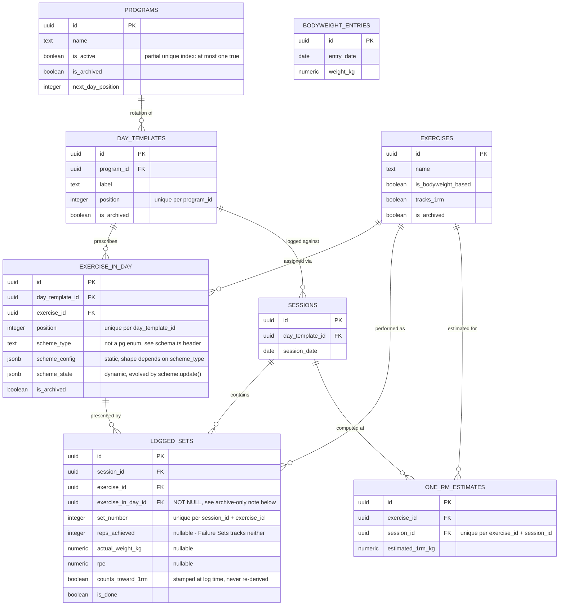

# ERD

Current state of `apps/web/db/schema.ts` (migrations `0000`/`0001`). Regenerate this diagram by hand whenever the schema changes — it's a snapshot, not generated from the schema file.

`BODYWEIGHT_ENTRIES` has no foreign keys — it's a standalone log, not tied to a program/session.

## Non-obvious constraints

Worth knowing before touching this schema — see [ADR-0001](../../adr/0001-archive-only-across-referenced-entities.md) and [CONTEXT.md](../../../CONTEXT.md) for the full reasoning:

- **Archive-only.** `programs`, `day_templates`, `exercise_in_day`, `exercises` are never hard-deleted, only flagged `is_archived`. That's why `logged_sets.exercise_in_day_id` is `NOT NULL` — the row it points at always still exists.
- **`one_active_program`** — a partial unique index (`is_active = true`), not application-level validation. Covered by the integration test in `apps/web/db/schema.integration.test.ts` (see [testing.md](../testing.md)).
- **`scheme_type` is plain text**, not a Postgres enum — the scheme catalog has already grown once organically (Failure Sets added after the fact); an enum would force a migration every time it grows again. The known set is enforced in application code (`SCHEME_TYPES` in `schema.ts`).
- **One-RM estimates are one row per (exercise, session)** — the highest Epley estimate among that session's qualifying sets, computed once at save time, not one row per set.
